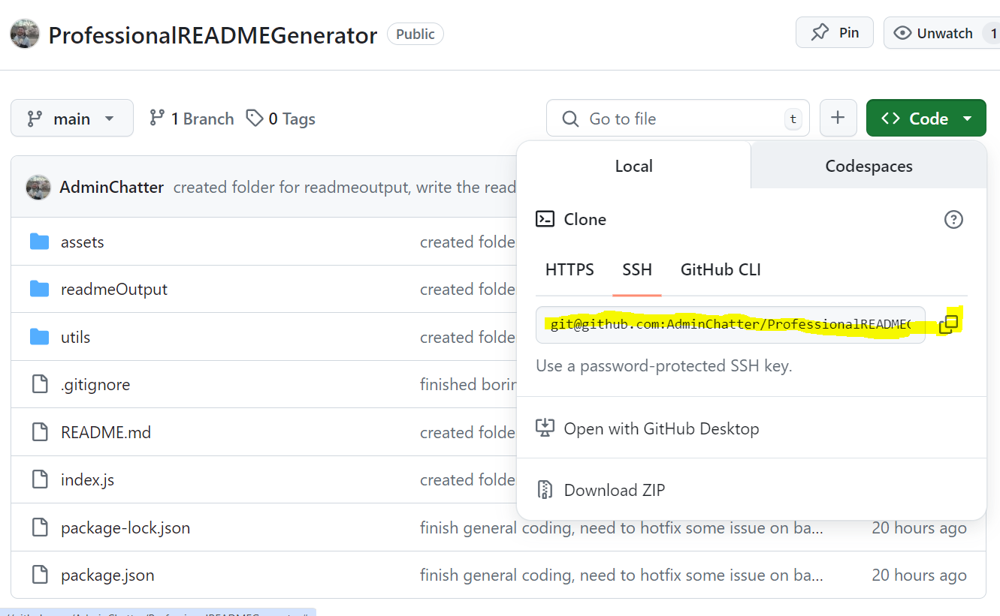
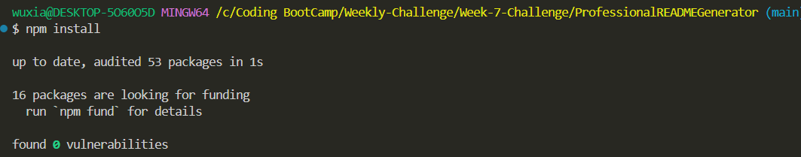
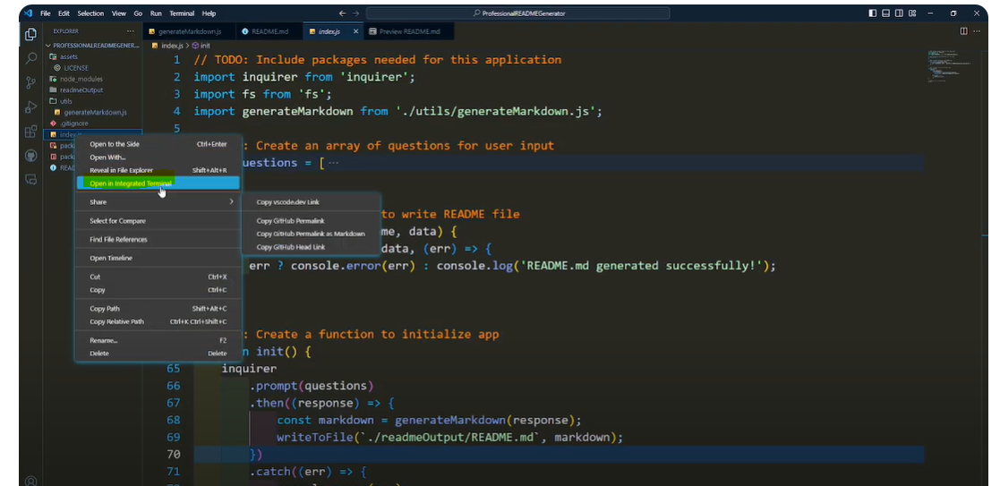
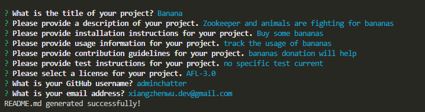

# Markdown Generator API

## Description

This project is a Markdown Generator API that simplifies the process of creating professional README files for your projects. By answering a series of prompts, users can quickly generate a comprehensive README file. The output file can be find in output folder

## Table of Contents

- [Installation](#installation)
- [Usage](#usage)
- [DemoVideo](#demovideo)
- [Credits](#credits)
- [License](#license)
- [Badges](#badges)
- [Features](#features)
- [How to Contribute](#how-to-contribute)
- [Tests](#tests)

## Installation

1. Clone the repository from my [github](https://github.com/adminchatter).
    ```bash
    git clone git@github.com:AdminChatter/ProfessionalREADMEGenerator.git
    ```
    <br><br>

2. Navigate to the project directory.
    ```bash
    cd ProfessionalREADMEGenerator
    ```

3. Install dependencies.
    ```bash
    npm install
    ```
     <br><br>

4. Run the Application in the integrated terminal
    ```bash
    npm start
    ```

    <br><br>

## Usage

1. Run the application.
    ```bash
    npm start
    ```

2. Answer the prompts to generate your README file.



## DemoVideo

There is a demostration video in [youtube](https://youtu.be/nQZLaSolYPs)


## Credits

Made by AdminChatter
GitHub: https://github.com/adminchatter

If you have any questions, please contact me at xiangzhenwu.dev@gmail.com

## License

This project is licensed under the [MIT](https://opensource.org/licenses/MIT) license.<BR>
Click the license above to learn more about this license.

## Badges


## Features

* Simplifies the creation of professional README files
* Interactive prompts for user input
* Supports multiple licenses

## How to Contribute

If you would like to contribute to this project, please fork the repository and create a pull request. For major changes, please open an issue first to discuss what you would like to change.

## Tests

To run tests, use the following command:
```bash
npm run test
```
